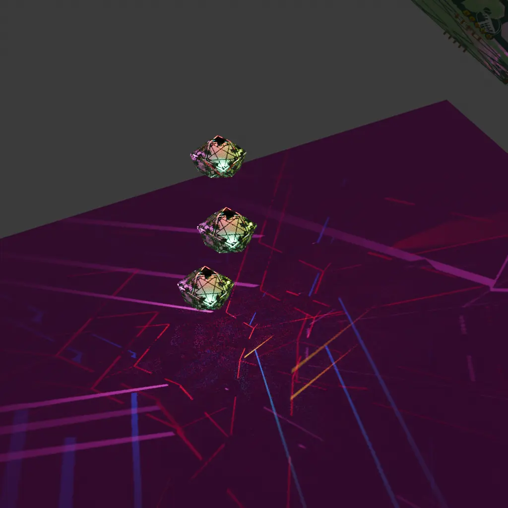

# Johnson solid lamps!

So I thought it'd be superduper cool to make lamps as like johnson solids, so here's some kicad files for that.

There's two versions for each polygon:
1. solder mask only.
2. Solder mask and edge cuts

So you can create directional lamps with soft light in the facing direction using the pcb as diffuser adn stronger light in the backfacing direction.

More will be added once a lamp is actually made

## Exporting for jlpcb

Great thanks to [FunDeckHermit's](https://github.com/FunDeckHermit/NURD-Template) pcb exporter. I've slightly modified it so I can run it from the top-level on any file.

upload zip file to jlpcb. It can be that edge cuts don't work. fix in inkscape.

## Making mask and edge cuts

mask:

1. Plot svgs. Set F.Cu, B.Cu to all layers
2. open F.Cu in inkscape
3. select all, 2x`Ctrl-Shift-G`, `Ctrl-Shift-C`, `Ctrl-Alt-C`, `Ctrl-Shift-+` `Ctrl-Shift-)`
4. There will be some specs, either:
   - have a great time with the node tool
   - `Ctrl-Shift-K` to unmerge, select desired polygons, `!` to invert selection and delete
4. save as...
5. in kicad, `Ctrl-Shift-L`, enable "place at position `0,0`

edge:

1. Plot svgs. Set F.Cu, B.Cu, Edge.Cuts to all layers
2. open F.Cu in inkscape
3. select all, 2x`Ctrl-Shift-G`, `Ctrl-Shift-C`, `Ctrl-Alt-C`, `Ctrl-Shift-+` 2x`Ctrl-Shift-)`
4. There will be specs and some tiny gaps/overlaps.
   - fixs specs as before
   - overlaps can be fixed with running `Ctrl-Shift-+`
   - tiny gaps are equally bad. These require some fun with the node tool
     1. `Shift-doubleclick` at the narrowest point to place nodes
     2. split
     3. overlapping nodes: box select one, shift-click to get the bottom, then select the other, connect with edge, then merge to one
4. save as...
5. in kicad, `Ctrl-Shift-L`, enable "place at position `0,0`

# Reflections after making 3 lamps and soldering 350+ LEDs

So yeah, I think I'll really order the next pcbs with the leds assembled

Bending the header pins with a pcb works, but the led next to the header may want a bit of lovd afterwards. I think the flexing causes microfractures or something, but in any case, the leds stop there

## overview

1. Sphenocorona - some leds not working because of flexing breaking solder joints. Somehow it makes noise?
2. Thawro - perfect! I removed-and-bypassed some leds because I thought they were broken, but turned out it was because of WLED shenanigans
3. Bilb - smooth rolling

## WLED shenanigans

So whenever you set a pattern at boot, the length of the strip is saved in the json at "stop", so whenever increasing strip length, the leds after will not show.

Still not sure which is the best pattern for debugging leds. Solid deffo not, it needs to be changing, because a led that got a "be pink" signal will stay pink without further input. Android is fine, but when the strip setting is much larger, it is not happy. Ideally it'd be some sort of "two-color-twinkle" or something.

## howto header pins

general policy: Every bare edge exposes headers. Use a triangle full pcb to bend them in place. You want to bend it so the pcb can be flatter than it needs to be, otherwise angled pins make inserting a headache (especially for later boards).

## sharp angles

Sharp dihedral angles make the corner leds collide, resulting in a slightly sad shape. maybe add tiny jumper pads to easily bypass a led.

## Control board

Ah yes, so the ESP32-C3-WROOM boards start up in a boot loop. To solve, you have to hold BOOT (GPIO9, next to GND) low and tap EN, as this person on Github said. GPIO9 can be set as "cycle presets" or something, because getting your phone out all the time is sad.

## Double-size?

So these lamps are like nice for in a bedroom or toilet, but for living room, make double-size pcbs with two connections so they are also compatible with the others

## blrubs

ah yes ws2812s dont like fighting data, so need to cut some data pins to avoid that.
